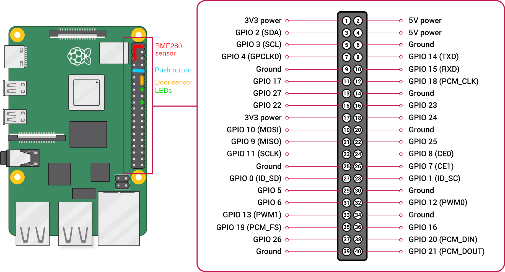

# Setting up the Raspberry Pi



# Setup

After installing a fresh version of Raspbian, and cloning this repo, follow [the beginning of a tutorial I have written](https://romainpellerin.eu/raspberry-pi-the-ultimate-guide.html) to set up the Pi. Do not set `max_usb_current=1` if the power supply cannot output more than 1A. When running `raspi-config`, make sure to:

- Enable the camera. First make sure it works by running `libcamera-still -o test.jpg`.
- Give the GPU at least 128MB (more is recommended, apparently)

You can stop reading the tutorial at the end of the section "Configuration".

## Crontab

```bash
crontab -e
# Daily cleaning of /var/lib/minidlna and /tmp (videos and pictures from the webcam). Durations are in days (`mtime`).
0 21 * * * find /var/lib/minidlna -type f -mtime +2 -delete
0 21 * * * find /var/lib/minidlna -type d -mtime +2 -empty -delete
0 21 * * * find /tmp -type f -iname '*.mp4' -mtime +90 -delete
0 21 * * * find /tmp -type f -iname '*.h264' -mtime +90 -delete
0 21 * * * find /tmp -type f -iname '*.jpg' -mtime +90 -delete

# Periodic update of Strava activities
0 */1 * * * DRY_RUN=0 COMMUTE_IF_CLOSE_TO="40.987,20.123" CLIENT_ID=123 CLIENT_SECRET="abc456" REFRESH_TOKEN=xyz /path/to/raspberry-pi-home-automation/auto-mute-strava-activities.py

# Periodic reporting of temperature
*/3 * * * * /path/to/raspberry-pi-home-automation/report_weather.py

# Remote control of the Raspberry Pi. TODO: merge the two files?
*/5 * * * * /path/to/raspberry-pi-home-automation/update-should-send-emails.py
*/6 * * * * /path/to/raspberry-pi-home-automation/update-should-reboot.py

# French and German news. There are antislashes before the % signs, cause % signs have a special meaning for cron.
05 21 * * * /path/to/raspberry-pi-home-automation/bin/20h.py
15 22 * * * /path/to/raspberry-pi-home-automation/.venv/bin/yt-dlp https://www.ardmediathek.de/sendung/tagesschau/Y3JpZDovL2Rhc2Vyc3RlLmRlL3RhZ2Vzc2NoYXU -I 1  -o "/var/lib/minidlna/\%(title)s.\%(ext)s" --embed-subs
# Removing the subtitles file from German news
30 22 * * * find /var/lib/minidlna -type f -iname '*.vtt' -delete

sudo su
crontab -e
@reboot /bin/sleep 20; /usr/sbin/exim -qff; echo "So you know... ($(/bin/date))\n\n$(/usr/bin/tail -n 500 /var/log/syslog)" | mail -s "Rpi turned on 20secs ago" root
```

## Rest of the setup

Now make sure the camera is correctly detected:

```bash
sudo vcgencmd get_camera
```

```bash
sudo apt install python3-gpiozero redis-server python3-picamera ffmpeg libatlas-base-dev python3-picamera2 python3-opencv
# TODO: remove python3-opencv, not needed anymore? Same for python3-picamera, replaced by python3-picamera2?

cd /to/the/cloned/repo

python3 -m venv --system-site-packages .venv # --system-site-packages to have the system-installed picamera2 module available
source .venv/bin/activate
pip3 install -r requirements.txt

./build-arduino-sketch-and-deploy.py

sudo cp \
    systemd-services/shutdown.service \
    systemd-services/door-sensor.service \
    systemd-services/video-recorder.service \
      /etc/systemd/system

sudo systemctl enable shutdown.service
sudo systemctl enable door-sensor.service
sudo systemctl enable video-recorder.service

sudo systemctl daemon-reload

sudo systemctl start shutdown.service
sudo systemctl start door-sensor.service
sudo systemctl start video-recorder.service
```

# Temperature, humidity, pressure

Head over to [report_weather.README.md](report_weather.README.md).

# MiniDLNA

## Foreword

MiniDLNA is the former name. The project is now called ReadyMedia. You can find it [here](https://sourceforge.net/projects/minidlna/).

## Install

You may install it through `apt` but you might get an old version (check with `sudo apt search minidlna`). In my case, as of February 2023, I would have gotten version 1.3.0 through `apt`, while 1.3.2 is already out, with `.webm` supported freshly added. So I decided to compile it myself from upstream.

### Manual install

```bash
# Prerequisite
sudo apt install build-essential gettext
# gettext is needed on Raspberry Pi:
# reddit.com/r/raspberry_pi/comments/9qq3y5/readymedia_12x_fails_with_cannot_stat_tdagmo_no/

# Download
wget https://nav.dl.sourceforge.net/project/minidlna/minidlna/1.3.2/minidlna-1.3.2.tar.gz
tar -xvf minidlna-1.3.2.tar.gz
cd minidlna-1.3.2

# Compile
./configure
# Based on errors you got with the above-mentioned command, you'll have to
# sudo apt install libavutil-dev libavcodec-dev libavformat-dev libjpeg-dev libsqlite3-dev libexif-dev \
#   libid3tag0-dev libogg-dev libvorbis-dev libflac-dev
# and relaunch ./configure
make

#Install
sudo make install

sudo mkdir /var/cache/minidlna
sudo mkdir /var/lib/minidlna
sudo chown minidlna:minidlna /var/cache/minidlna
sudo chown minidlna:minidlna /var/lib/minidlna
sudo chmod -R o+rX /var/lib/minidlna

# Configure
sudo cp minidlna.conf /etc/
sudo vim /etc/minidlna.conf
# friendly_name=some_nicer_name_than_the_default_hostname
# log_dir=/var/log
# media_dir=/var/lib/minidlna

# Now copy the service from this repo and start it
sudo cp systemd-services/minidlna.service /etc/systemd/system
sudo systemctl enable minidlna.service
sudo systemctl daemon-reload
sudo systemctl start minidlna.service
```

# Further reading

## Fine tuning when using a SD card only (no external SDD)

```bash
sudo tune2fs -c -1 -i 0 /dev/mmcblk0p2 # no check when booting
sudo tune2fs -O ^has_journal /dev/mmcblk0p2 # no journalling, must be done from a PC on mmcblk0p2 unmounted
```

In `/etc/fstab`:

```bash
/dev/mmcblk0p2 / ext4 defaults,noatime 0 0 # final zero means never run fsck
tmpfs /tmp tmpfs defaults,noatime,size=34m 0 0
tmpfs /var/log tmpfs defaults,noatime,size=30m 0 0
```

Also disable swaping to extend your SD card lifetime:

```bash
sudo swapoff --all # Temporary
sudo update-rc.d -f dphys-swapfile remove
sudo apt remove dphys-swapfile # Permanently
sudo rm /var/swap
```

## Links

- [Smarten up your Pi Zero Web Camera with Image Analysis and Amazon Web Services (Part 1)](https://www.bouvet.no/bouvet-deler/utbrudd/smarten-up-your-pi-zero-web-camera-with-image-analysis-and-amazon-web-services-part-1)
- [Limit the runtime of a cronjob or script](https://ma.ttias.be/limit-runtime-cronjob-script/)
- [A Guide to Recording 660FPS Video On A $6 Raspberry Pi Camera](http://blog.robertelder.org/recording-660-fps-on-raspberry-pi-camera/)
- [Xiaomi Miijia LYWSD03MMC with pure bluetoothctl](https://false.ekta.is/2021/06/xiaomi-miijia-lywsd03mmc-with-pure-bluetoothctl/)
- [Multiple cameras with the Raspberry Pi and OpenCV](https://pyimagesearch.com/2016/01/18/multiple-cameras-with-the-raspberry-pi-and-opencv/)
- [Making my own NVR — with a streaming proxy and FFmpeg](https://blog.cavelab.dev/2024/01/diy-nvr-ffmpeg/)
- [Making a manual security alarm in Home Assistant](https://blog.cavelab.dev/2021/11/home-assistant-manual-alarm/)
- [Raspberry Pi security alarm — the basics](https://blog.cavelab.dev/2022/12/rpi-security-alarm/)
